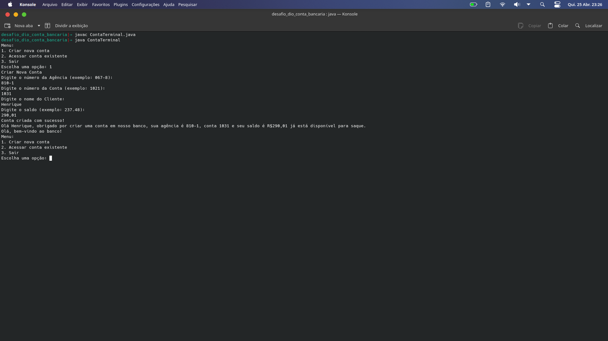

# Desafio: ContaBanco

## Apresentação do Desafio
Este desafio faz parte da trilha de Java Básico na plataforma DIO (Digital Innovation One). O objetivo é praticar os conceitos apresentados no módulo de Sintaxe codificando um cenário específico.

## Autores
- Gleyson Sampaio

## Sintaxe - Desafio

### Cenário
Vamos exercitar todo o conteúdo apresentado no módulo de Sintaxe codificando o seguinte cenário.

### Descrição do Desafio
Criar o projeto `ContaBanco` que receberá dados via terminal contendo as características de uma conta bancária conforme os atributos abaixo:

#### Atributos da Conta
- Numero (Inteiro)
- Agencia (Texto)
- Nome Cliente (Texto)
- Saldo (Decimal)

### Tarefa
Dentro do projeto, criar a classe `ContaTerminal.java` para realizar toda a codificação do programa.

### Orientações
- Rever as regras de declaração de variáveis.
- Permitir que os dados sejam inseridos via terminal, com o usuário recebendo a mensagem de qual informação será solicitada.
- Utilizar a classe Scanner para capturar os dados inseridos pelo usuário.
- Após a inserção de todas as informações, o sistema deve exibir a seguinte mensagem:

## Resultado

## Ferramentas 

Java

IDE: VS Code

## Desenvolvedor

Henrique
